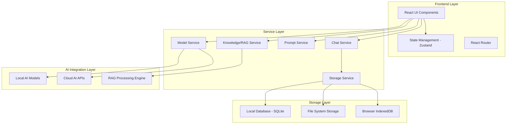
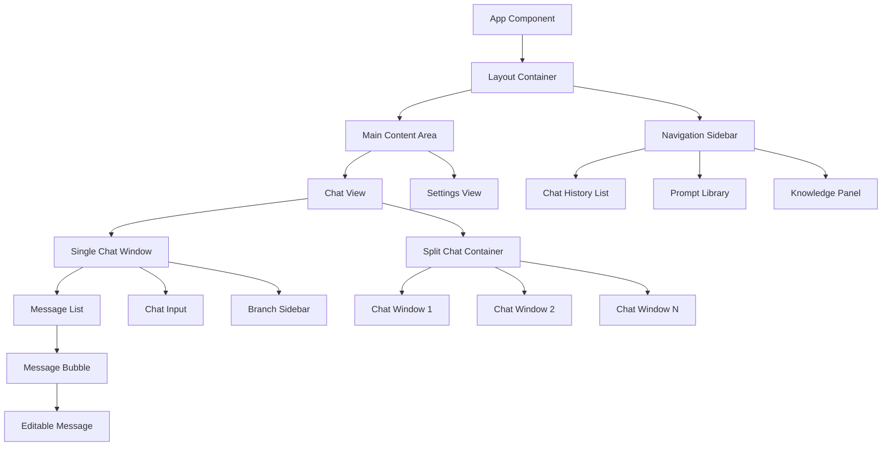

# Design Document

## Overview

The AI Chat Assistant is a modern, cross-platform application built with React and ShadCN UI components, designed to provide an advanced conversational AI experience. The application supports both Electron desktop and web deployment, with a focus on offline-first functionality, multi-model AI integration, and sophisticated conversation management features including branching, prompt libraries, and knowledge integration (RAG).

The architecture emphasizes performance, privacy, and user experience, drawing inspiration from Msty.app's innovative approach to AI chat interfaces while maintaining a clean, accessible design system.

## Architecture

### High-Level Architecture



### Technology Stack

- **Frontend Framework**: React 18+ with TypeScript
- **UI Components**: ShadCN UI with Tailwind CSS
- **State Management**: Zustand for global state
- **Desktop Runtime**: Electron (latest stable)
- **Database**: SQLite for desktop, IndexedDB for web
- **Styling**: Tailwind CSS with CSS Grid/Flexbox
- **Build Tool**: Vite for fast development and building
- **Testing**: Vitest + React Testing Library

### Cross-Platform Strategy

The application uses a shared React codebase with platform-specific adapters:

- **Desktop (Electron)**: Full filesystem access, native menus, system integration
- **Web**: Progressive Web App (PWA) with service workers for offline functionality
- **Shared Components**: All UI components work identically across platforms
- **Platform Detection**: Runtime detection for platform-specific features

## Components and Interfaces

### Core Component Architecture



### Component Specifications

#### 1. App Component
- **Purpose**: Root application component and routing
- **State**: Global theme, authentication status
- **Responsibilities**: Route management, global error boundary, theme provider

#### 2. Layout Container
- **Purpose**: Main application layout with sidebar and content area
- **State**: Sidebar collapsed state, current view
- **Responsive**: Collapses sidebar on mobile, adjusts grid layout

#### 3. Navigation Sidebar
- **Purpose**: Primary navigation and quick access to features
- **Components**: 
  - Chat history list with search
  - Quick access buttons (New Chat, Prompt Library, Knowledge, Settings)
  - Collapsible sections for organization
- **State**: Expanded sections, search query, selected chat

#### 4. Chat Window Component
- **Purpose**: Core chat interface (reusable for single and split views)
- **Props**: `chatId`, `modelId`, `isActive`, `onMessage`
- **State**: Message list, input value, streaming status
- **Features**: Message streaming, editing, branching controls

#### 5. Message Components
```typescript
interface MessageBubbleProps {
  message: Message;
  isEditing: boolean;
  onEdit: (content: string) => void;
  onBranch: () => void;
  onRegenerate?: () => void;
}

interface Message {
  id: string;
  content: string;
  role: 'user' | 'assistant';
  timestamp: Date;
  isEdited: boolean;
  parentId?: string;
  branchId?: string;
}
```

#### 6. Split Chat Container
- **Purpose**: Manages multiple chat windows for model comparison
- **State**: Active models, synchronized input, layout configuration
- **Features**: Add/remove panels, synchronized scrolling, responsive layout

#### 7. Branch Sidebar
- **Purpose**: Visualizes and navigates conversation branches
- **Components**: Tree view, minimap toggle, branch navigation
- **State**: Current branch, expanded nodes, minimap visibility

#### 8. Prompt Library Modal
- **Purpose**: Manages saved prompts and templates
- **Components**: Search bar, prompt list, prompt editor, tag management
- **State**: Search query, selected prompt, editing mode

#### 9. Knowledge Panel
- **Purpose**: Manages RAG knowledge sources
- **Components**: Source list, upload interface, indexing status, stack management
- **State**: Active sources, indexing progress, selected stack

### Data Models

#### Chat Data Model
```typescript
interface Chat {
  id: string;
  title: string;
  createdAt: Date;
  updatedAt: Date;
  folderId?: string;
  messages: Message[];
  branches: Branch[];
  activeKnowledgeStacks: string[];
}

interface Branch {
  id: string;
  parentMessageId: string;
  messages: Message[];
  title?: string;
}
```

#### Prompt Library Model
```typescript
interface SavedPrompt {
  id: string;
  title: string;
  description?: string;
  content: string;
  tags: string[];
  createdAt: Date;
  usageCount: number;
  isFavorite: boolean;
}
```

#### Knowledge Source Model
```typescript
interface KnowledgeSource {
  id: string;
  name: string;
  type: 'file' | 'folder' | 'url';
  path: string;
  stackId: string;
  status: 'indexing' | 'ready' | 'error';
  indexedAt?: Date;
  size: number;
  chunkCount?: number;
}

interface KnowledgeStack {
  id: string;
  name: string;
  description?: string;
  sources: KnowledgeSource[];
  isActive: boolean;
}
```

## Data Models

### State Management Architecture

Using Zustand for predictable state management with the following stores:

#### Chat Store
```typescript
interface ChatStore {
  // State
  chats: Chat[];
  currentChatId: string | null;
  currentBranchId: string | null;
  
  // Actions
  createChat: (title?: string) => string;
  deleteChat: (chatId: string) => void;
  addMessage: (chatId: string, message: Omit<Message, 'id'>) => void;
  editMessage: (chatId: string, messageId: string, content: string) => void;
  createBranch: (chatId: string, fromMessageId: string) => string;
  switchBranch: (chatId: string, branchId: string) => void;
}
```

#### Model Store
```typescript
interface ModelStore {
  // State
  availableModels: AIModel[];
  activeModels: string[];
  modelConfigs: Record<string, ModelConfig>;
  
  // Actions
  addModel: (model: AIModel) => void;
  removeModel: (modelId: string) => void;
  updateModelConfig: (modelId: string, config: Partial<ModelConfig>) => void;
  setActiveModels: (modelIds: string[]) => void;
}
```

#### Settings Store
```typescript
interface SettingsStore {
  // State
  theme: 'light' | 'dark' | 'auto';
  apiKeys: Record<string, string>;
  privacySettings: PrivacySettings;
  uiPreferences: UIPreferences;
  
  // Actions
  updateTheme: (theme: string) => void;
  setApiKey: (service: string, key: string) => void;
  updatePrivacySettings: (settings: Partial<PrivacySettings>) => void;
}
```

### Database Schema

#### SQLite Schema (Desktop)
```sql
-- Chats table
CREATE TABLE chats (
  id TEXT PRIMARY KEY,
  title TEXT NOT NULL,
  created_at DATETIME DEFAULT CURRENT_TIMESTAMP,
  updated_at DATETIME DEFAULT CURRENT_TIMESTAMP,
  folder_id TEXT,
  metadata JSON
);

-- Messages table
CREATE TABLE messages (
  id TEXT PRIMARY KEY,
  chat_id TEXT NOT NULL,
  branch_id TEXT,
  parent_id TEXT,
  content TEXT NOT NULL,
  role TEXT NOT NULL CHECK (role IN ('user', 'assistant')),
  timestamp DATETIME DEFAULT CURRENT_TIMESTAMP,
  is_edited BOOLEAN DEFAULT FALSE,
  metadata JSON,
  FOREIGN KEY (chat_id) REFERENCES chats(id) ON DELETE CASCADE
);

-- Prompts table
CREATE TABLE prompts (
  id TEXT PRIMARY KEY,
  title TEXT NOT NULL,
  description TEXT,
  content TEXT NOT NULL,
  tags JSON,
  created_at DATETIME DEFAULT CURRENT_TIMESTAMP,
  usage_count INTEGER DEFAULT 0,
  is_favorite BOOLEAN DEFAULT FALSE
);

-- Knowledge sources table
CREATE TABLE knowledge_sources (
  id TEXT PRIMARY KEY,
  name TEXT NOT NULL,
  type TEXT NOT NULL,
  path TEXT NOT NULL,
  stack_id TEXT NOT NULL,
  status TEXT NOT NULL,
  indexed_at DATETIME,
  size INTEGER,
  chunk_count INTEGER,
  metadata JSON
);
```

## Error Handling

### Error Categories and Strategies

#### 1. Network Errors (Cloud AI APIs)
- **Strategy**: Graceful degradation to local models when available
- **UI Feedback**: Clear error messages with retry options
- **Fallback**: Queue messages for retry when connection restored

#### 2. Model Loading Errors
- **Strategy**: Display specific error messages for different failure types
- **Recovery**: Automatic fallback to alternative models
- **User Action**: Clear instructions for resolving configuration issues

#### 3. File Processing Errors (RAG)
- **Strategy**: Partial processing with detailed error reporting
- **UI Feedback**: File-specific error indicators with retry options
- **Recovery**: Skip problematic files, continue with successful ones

#### 4. Storage Errors
- **Strategy**: In-memory fallback with data loss warnings
- **Recovery**: Automatic retry with exponential backoff
- **User Action**: Export data options before attempting fixes

### Error Boundary Implementation
```typescript
interface ErrorBoundaryState {
  hasError: boolean;
  error?: Error;
  errorInfo?: ErrorInfo;
}

class ChatErrorBoundary extends Component<Props, ErrorBoundaryState> {
  // Catches errors in chat components
  // Provides recovery options (refresh chat, clear state)
  // Maintains other app functionality
}
```

### Offline Error Handling
- **Detection**: Network status monitoring
- **Queue**: Message queue for offline operations
- **Sync**: Automatic synchronization when online
- **Feedback**: Clear offline indicators and limitations

## Testing Strategy

### Testing Pyramid

#### 1. Unit Tests (70%)
- **Components**: All React components with React Testing Library
- **Services**: Business logic and API integration
- **Utilities**: Helper functions and data transformations
- **State Management**: Zustand store actions and selectors

#### 2. Integration Tests (20%)
- **User Flows**: Complete user journeys (create chat, send message, branch conversation)
- **API Integration**: Mock external AI services
- **Storage**: Database operations and data persistence
- **Cross-Component**: Component interaction and data flow

#### 3. End-to-End Tests (10%)
- **Critical Paths**: Core functionality across the entire application
- **Platform-Specific**: Electron vs web-specific features
- **Performance**: Load testing with large chat histories
- **Accessibility**: Screen reader and keyboard navigation

### Testing Tools and Configuration

#### Frontend Testing
```typescript
// Component testing example
describe('MessageBubble', () => {
  it('should render user message correctly', () => {
    const message = createMockMessage({ role: 'user' });
    render(<MessageBubble message={message} />);
    expect(screen.getByText(message.content)).toBeInTheDocument();
  });

  it('should enable editing when edit button clicked', async () => {
    const message = createMockMessage();
    const onEdit = vi.fn();
    render(<MessageBubble message={message} onEdit={onEdit} />);
    
    await user.click(screen.getByRole('button', { name: /edit/i }));
    expect(screen.getByRole('textbox')).toBeInTheDocument();
  });
});
```

#### Service Testing
```typescript
// Service testing example
describe('ChatService', () => {
  it('should create new chat with generated title', async () => {
    const chatService = new ChatService(mockStorage);
    const chatId = await chatService.createChat();
    
    expect(chatId).toBeDefined();
    expect(mockStorage.saveChat).toHaveBeenCalled();
  });
});
```

### Performance Testing
- **Metrics**: First Contentful Paint, Time to Interactive, Memory usage
- **Scenarios**: Large chat histories, multiple model responses, file indexing
- **Tools**: Lighthouse, React DevTools Profiler, Custom performance monitoring

### Accessibility Testing
- **Automated**: axe-core integration in tests
- **Manual**: Screen reader testing (NVDA, JAWS, VoiceOver)
- **Keyboard Navigation**: Tab order and keyboard shortcuts
- **Color Contrast**: Automated contrast ratio validation

### Cross-Platform Testing
- **Desktop**: Electron-specific features and native integrations
- **Web**: Browser compatibility and PWA functionality
- **Responsive**: Various screen sizes and orientations
- **Performance**: Platform-specific optimizations

This comprehensive design provides a solid foundation for implementing the AI chat assistant with all the advanced features outlined in the requirements. The architecture emphasizes modularity, testability, and maintainability while ensuring excellent user experience across platforms.